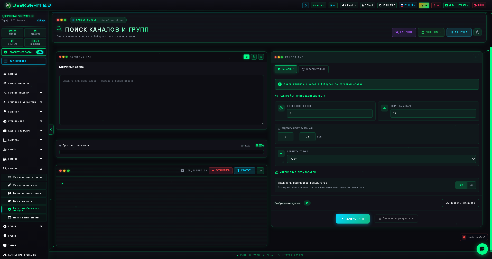
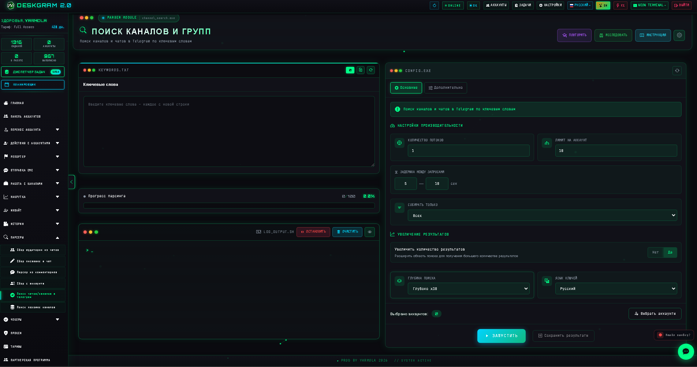
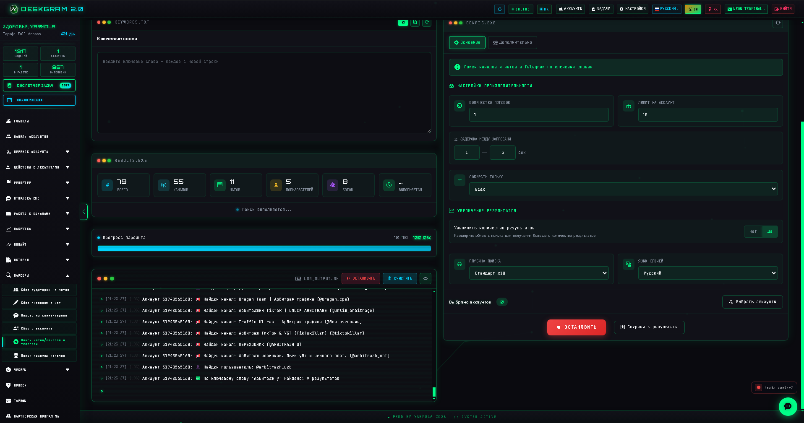
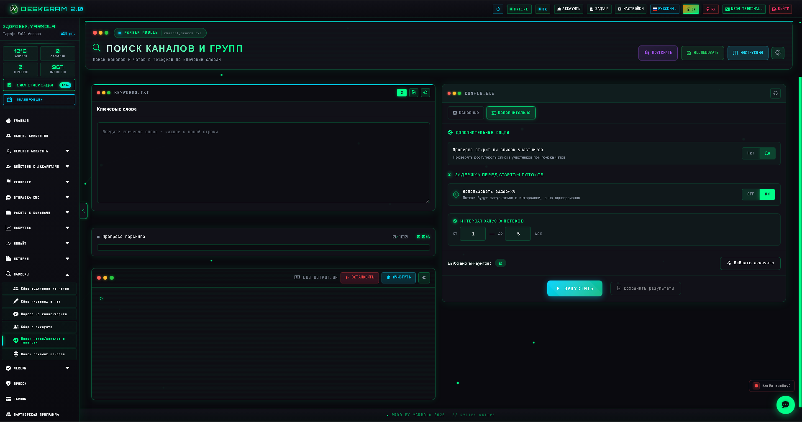

# Поиск каналов и групп Telegram через Deskgram 2

Поиск каналов и групп в Deskgram 2 помогает быстро собрать базу Telegram-площадок по ключевым словам и подготовить ее для дальнейшего парсинга, анализа, рекламы или ручной проверки. Модуль полезен, когда нужно не просто найти несколько каналов вручную, а системно расширять карту нишевых площадок.

[Главный хаб Deskgram 2](https://github.com/Deskgram-2/deskgram-2-telegram-automation) · [Сайт](https://deskgram2.com/) · [Telegram-бот](https://t.me/DG2welcomebot) · [Web preview](https://deskgram2.com/web-preview)

## Скриншоты

## Кратко о модуле

| Параметр | Что внутри |
|---|---|
| Основная задача | Поиск Telegram-каналов и групп по ключевым словам |
| Важные блоки | Ключевые слова, результаты, фильтрация, статистика, логи |
| Полезен для | Исследования ниши, сбора базы источников, подготовки парсинга |
| Связанные модули | Сбор аудитории, Поиск похожих каналов, Сбор из комментариев |

## Что умеет модуль

- искать каналы и группы Telegram по списку ключевых слов;
- собирать результаты в единую таблицу;
- показывать прогресс, статистику и логи;
- отсеивать нерелевантные площадки через фильтрацию;
- готовить список источников для следующих модулей.

## Быстрый старт

1. Подготовьте список ключевых слов по вашей нише.
2. Задайте параметры поиска и лимиты.
3. Запустите модуль и дождитесь первичных результатов.
4. Отфильтруйте найденные каналы и группы.
5. Передайте лучшие результаты в модули сбора аудитории или анализа.

## Куда вести результаты дальше

- [Поиск похожих каналов](https://github.com/Deskgram-2/telegram-similar-channels-deskgram), если хотите расширить карту ниши от первых сильных площадок;
- [Сбор аудитории](https://github.com/Deskgram-2/telegram-audience-parser-deskgram), если дальше нужен парсинг подписчиков или участников;
- [Сбор из комментариев](https://github.com/Deskgram-2/telegram-comment-audience-parser-deskgram), если нужна более живая база по активности под постами;
- [Сбор писавших в чатах](https://github.com/Deskgram-2/telegram-active-chat-users-parser-deskgram), если фокус на обсуждениях и живых сообществах;
- [Инвайт](https://github.com/Deskgram-2/telegram-invite-tool-deskgram), если после discovery вы строите рост групп и каналов;
- [Диспетчер задач](https://github.com/Deskgram-2/telegram-task-manager-deskgram), если хотите контролировать поисковые и парсинговые сценарии из одной операционной точки.

## Как устроен сценарий

### Ключевые слова

В модуле задается список запросов, по которым Deskgram 2 ищет Telegram-каналы и группы. Чем точнее кластер ключей, тем чище итоговая база.

### Результаты

Найденные площадки собираются в таблицу, где удобно оценивать размер базы, прогресс и общее качество выдачи.

### Статистика и логи

Статистический блок нужен для контроля темпа поиска, а лог помогает быстро замечать дубли, ограничения и проблемные запросы.

## Когда особенно полезен

- когда нужно быстро найти Telegram-площадки в новой нише;
- когда вы собираете базу под рекламу, парсинг или ручную аналитику;
- когда важно не терять найденные каналы в хаотичном ручном поиске;
- когда хотите построить связку "поиск площадок -> сбор аудитории -> коммуникация".

## Почему это удобнее ручного поиска

| Ручной подход | Поиск каналов и групп в Deskgram 2 |
|---|---|
| Поиск разрознен и плохо масштабируется | Ключевые слова обрабатываются системно |
| Результаты легко потерять | Площадки собираются в одном рабочем интерфейсе |
| Сложно считать объем и темп | Есть прогресс, статистика и логи |
| Мало связей с дальнейшими шагами | Результаты удобно передавать в другие модули |

## Смежные репозитории

- [Главный хаб Deskgram 2](https://github.com/Deskgram-2/deskgram-2-telegram-automation)
- [Сбор аудитории](https://github.com/Deskgram-2/telegram-audience-parser-deskgram)
- [Поиск похожих каналов](https://github.com/Deskgram-2/telegram-similar-channels-deskgram)
- [Сбор из комментариев](https://github.com/Deskgram-2/telegram-comment-audience-parser-deskgram)
- [Сбор писавших в чатах](https://github.com/Deskgram-2/telegram-active-chat-users-parser-deskgram)
- [Инвайт](https://github.com/Deskgram-2/telegram-invite-tool-deskgram)
- [Диспетчер задач](https://github.com/Deskgram-2/telegram-task-manager-deskgram)

## FAQ

### Для чего подходит этот модуль лучше всего?

Для стартового поиска Telegram-площадок по нише, продукту или группе запросов.

### Это уже парсер пользователей?

Нет. Этот модуль ищет сами каналы и группы. Для аудитории лучше использовать парсеры, связанные в блоке выше.

### Можно ли использовать результаты дальше в воронке?

Да. Это хороший входной слой для последующего парсинга аудитории и коммуникации.
